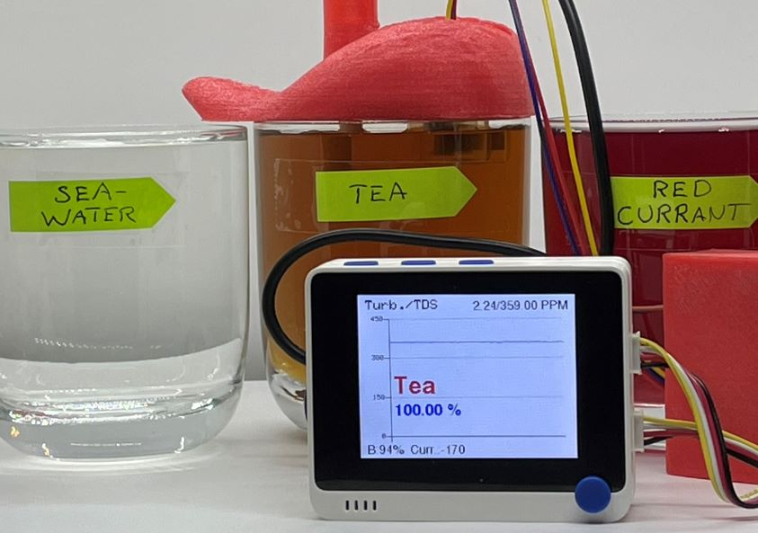
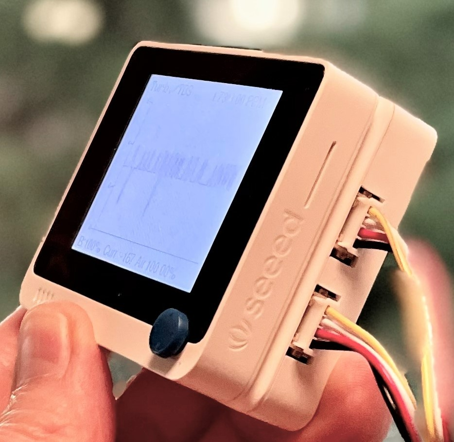
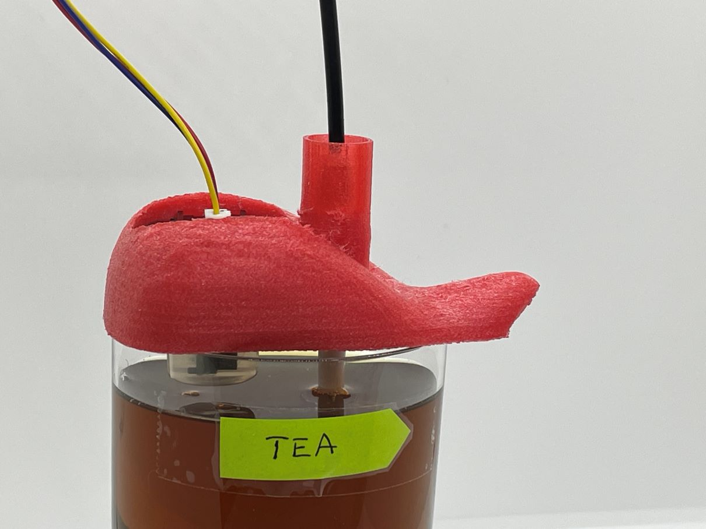
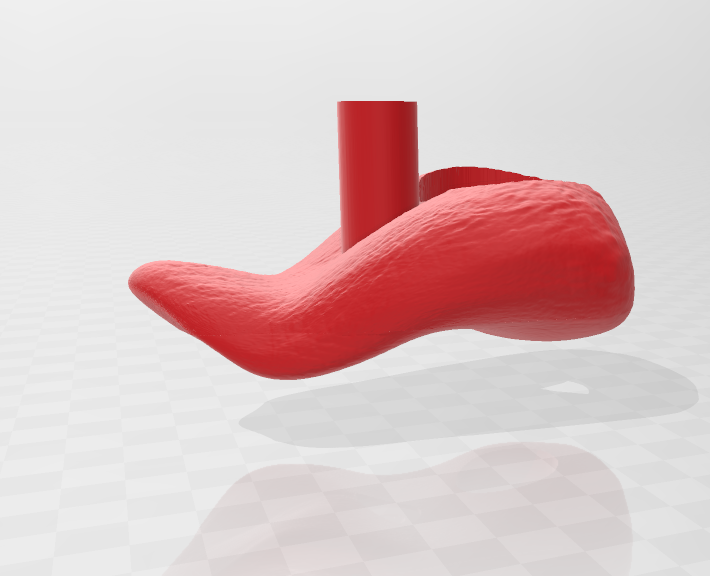

# Thomas' Tongue

# Introduction

Inspired by how Benjamin Cabé's amazing [artificial nose](https://blog.benjamin-cabe.com/2021/08/03/how-i-built-a-connected-artificial-nose) can recognize different scents, I thought it would be interesting to find out if it was possible to simulate the tastebuds of a human tongue to detect different types of - more or less - drinkable liquids. This tutorial shows how low-cost water quality sensors, together with WIO Terminal, were used to successfully detect five different liquids with help of TinyML (tiny Machine Learning).
  

# Use-case Explanation

A lot of people are unfortunately suffering from partial or complete anosmia (loss of smell) and ageusia (loss of taste). The reasons for the loss vary, but especially during the last few years Covid-19 has been recoqnized as one significant contributor. While most of the people having suffered through Covid-19 or other respitarory illnesses eventually fully recover their taste and smell capabilities, [one study](https://www.bmj.com/company/newsroom/millions-of-covid-patients-may-have-long-term-smell-and-taste-problems/#:~:text=They%20found%20that%20smell%20loss,of%20patients%20reported%20taste%20recovery) reports that approximately 5 % of patients having recovered from Covid-19 have a persisting loss of smell and/or taste a long time after.

Here we will go deeper into the problem that is being addressed.  We’ll want to provide evidence and data that the problem exists, and provide some possible improved outcomes and what we are hoping to achieve.  We need to establish credibility and demonstrate competence and innovation, so that readers have trust in the solution being presented.  This could be a good place to also further document the hardware features, sensors, or interfaces available on the board, describe what they do or what data they are intended to capture, and why that is important.  An image further detailing the problem or challenge would be useful, but might not be required depending upon the project.

# Components and Hardware Configuration

## Components

### Required
- [Wio Terminal](https://www.seeedstudio.com/Wio-Terminal-p-4509.html?queryID=9771732d93468a0f30dbfc5262e76c34&objectID=4509&indexName=bazaar_retailer_products), SKU 102991299
- [Grove - TDS Sensor/Meter For Water Quality](https://www.seeedstudio.com/Grove-TDS-Sensor-p-4400.html?queryID=4a630ba8b2d70bcfca1375237f32fc0d&objectID=4400&indexName=bazaar_retailer_products), SKU 101020753
- [Grove - Turbidity Sensor](https://www.seeedstudio.com/Grove-Turbidity-Sensor-p-4399.html?queryID=83279b52ae522a495d8f87efd2c3784c&objectID=4399&indexName=bazaar_retailer_products), SKU 101020752

### Optional but Recommended
- [Wio Terminal Chassis - Battery (650mAh)](https://www.seeedstudio.com/Wio-Terminal-Chassis-Battery-650mAh-p-4756.html?queryID=2b0ff4e58b77c003e5bc9e13352a3459&objectID=4756&indexName=bazaar_retailer_products), SKU 103990564
- 3D-printer to print tongue and case 
    - While PETG- or PLA-filaments also work, TPU-filament is recommended due to its softness and flexibility. For example, the case and the lid for the PCB boards fits perfectly together as they can be squeezed a bit when attaching to each other.
    - If you don't want to 3D-print a case for the PCB boards, at least put them in separate match boxes or similar to minimize the risk of liquids dropping on them. Electronics and liquids don't play well together...
    - The Turbidity sensor has holes on the top, so it's not water tight = do not immerse it completely in liquids. By a 3D-printed tongue, or by your own sensor case design, the sensors can be held at proper depth and thus minimizing the risk that the turbidity sensor breaks due to liquids inside it. Make it almost fool-proof by also putting hot glue or adhesive putty (Blu tack) on the holes.

## Hardware Configuration
- Put the PCB boards into the 3D-printed case first
- Connect the cable for the TDS-sensor to Grove port A2, and the cable for the Turbidity sensor to Grove port A4 on the battery chassis
    - you can of course use any other analog port as long as you change the relevant defines in the code (`#define TDS_Pin A2` and 
`#define turbidity_Pin A4`). If not using Grove ports or the battery chassis, you can use the 40-Pin GPIO Header at the back.
- Double-check the connections

### 3D-printing the Tongue and the PCB Case
- The different STL-files are found at the [GitHub repository](https://github.com/baljo/Tongue/tree/main/3D%20Model/STL-files)
    - [PCB case](https://github.com/baljo/Tongue/blob/main/3D%20Model/STL-files/PCB%20case.stl)
    - [PCB lid](https://github.com/baljo/Tongue/blob/main/3D%20Model/STL-files/PCB%20lid.stl)
    - [Tongue top](https://github.com/baljo/Tongue/blob/main/3D%20Model/STL-files/Tongue_top.stl)
    - [Tongue bottom](https://github.com/baljo/Tongue/blob/main/3D%20Model/STL-files/Tongue_bottom.stl)
- I used TPU-filament (from CCTree) for the first time and was surprised that it worked without issues on my budget Bowden-tube equipped 3D-printer. I did though not dare to go full speed (100 mm/s), instead used a moderate 50 mm/s, and a temperature of 220 °C. Print with high quality, I chose the max quality of 100 microns (0.1 mm), which made the printer working for hours with each part. 
- No support is needed, a brim or raft is though recommended. TPU-filament sticks better to the print bed than PLA, so a heated bed is probably not necessary, my printer is anyhow not having one.
- The "tongue" is split in two parts, the bottom part is not strictly needed, but provides some protection when the equipment is not in use.

### Attributions
The tongue is an adaption from this [3D-file](https://www.thingiverse.com/thing:644879) found at Thingiverse. All 3D-files I've created are licensed similarly as the original creator's (Attribution-ShareAlike 3.0 Unported/CC BY-SA 3.0).

# Intro / Overview
Briefly provide an introduction to your project. Address the following: what you are accomplishing, what the intended outcome is, highlight the use-case, describe the reasons for undertaking this project, and give a high level overview of the build. Provide a sentence or two for each of these aspects.  
Summarize the problem you are addressing in one or two sentences, and how your solution makes an impact.  Be sure to also give a brief introduction to the hardware you have chosen and any key features, or reasons why the selected hardware is a good fit for your project. 
Include a high-quality image of the hardware.

# Problem Being Solved / Use-case Explanation
Here we will go deeper into the problem that is being addressed.  We’ll want to provide evidence and data that the problem exists, and provide some possible improved outcomes and what we are hoping to achieve.  We need to establish credibility and demonstrate competence and innovation, so that readers have trust in the solution being presented.  This could be a good place to also further document the hardware features, sensors, or interfaces available on the board, describe what they do or what data they are intended to capture, and why that is important.  An image further detailing the problem or challenge would be useful, but might not be required depending upon the project.

# Components and Hardware Configuration
If any additional components are needed to build the project, include a list / Bill of Materials.  Normally this is formatted in a bulleted list, and quantity needed, to build the project.  After that, a description of how to set up the hardware, attach any sensors or secondary devices, flash any firmware or operating systems, install needed applications, and ultimately reach a point where we’re ready for Edge Impulse in the project.  We’ll definitely want some pictures of the hardware build process, showing the journey and setup that will guide readers through the process.

# Data Collection Process
Next we need to describe to a reader and demonstrate how data is collected.  Depending upon the type of the project, this might be done directly in the Edge Impulse Studio, via the use of a 3rd-party dataset, or data could be collected out in the field and later uploaded / ingested to Edge Impulse.  Data being captured should be explained, the specific process to capture it should be documented, and the loading of the data into Edge Impulse should be articulated as well.  Images will be helpful here, showing the device capturing data, or if you are making use of a pre-made dataset then you will need to describe where you acquired it, how you prepared the dataset for Edge Impulse, and what your upload process entails.  Pictures of the data capture and/or screenshots of loading the data will be needed.

# Training and Building the Model
Similar to the Data Collection Process section, a thorough description of the process used to build and train a model is important, so that readers can follow along and replicate your work.  Describe the elements in the Studio, the actions you take, and why.  Talk about the need for Training and Testing data, and when creating an Impulse,  Processing and Learning block options, Feature generation, and algorithm selection (FOMO, MobileNet, Yolo, etc) available to train and build the model.  Explain the selections you make, and the reasoning behind your choices.  Again images should be used here, screenshots walking a user through the process are very helpful.

# Model Deployment
Go into detail about the process of getting your resulting model into your application and onto your hardware.  This will of course vary by the target hardware, but explain what is occurring and how to flash your firmware, import the model if it’s a Linux device, or include a Library directly in your application.  Again describe the options presented to a user, and explain why you make the selections you do.  A few screenshots of the process would be useful.

# Results
Now it is time to show the finished project, deployed and running on the device.  Let’s talk about the results of running the model, presenting data, evidence, or statistics as appropriate.  Not all projects may meet their objectives, or perform well, but we should still present the outcomes truthfully.  If the project was extremely successful, then we can articulate on how the project could be scaled to truly make an impact.  If the project fell short of its goal, that is fine as well, and we can discuss what might have gone wrong, how the project could be improved, and provide lessons learned.  Screenshots or images might be needed here, as well.  

# Conclusion
A brief summary recapping what you built, why, and the outcome you achieved.  A few sentences wrapping up the project, any next steps you might take, or giving advice to the reader on how they can take your project and replicate it as-is, iterate, expand, or even scale your work.  All Expert Projects should be Public Projects, so explain that a reader can Clone your work and has access to your data, model, and can review the steps you took.  Reinforce the human health or machine health use case, and provide any final links or attribution.  
